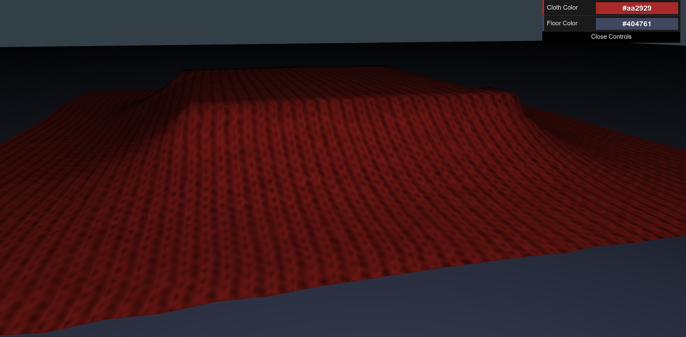
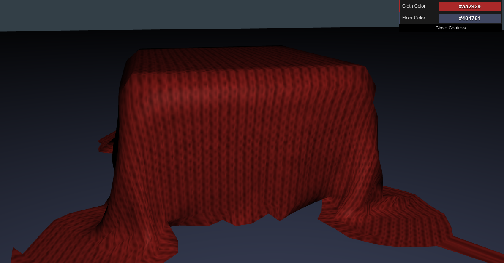
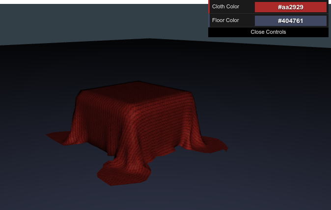
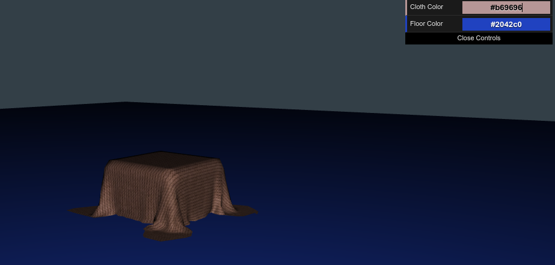

## Cloth Model

[Live Link](https://zlindacz.github.io/flex-cloth/)

Falling cloth


After the cloth falls and settles


Zoomed out view


Change colors of cloth and floor



### Background

This Cloth Model is an introduction to creating and rendering 3D objects using Three.js, a light-weight JavaScript library that provides tools for working with Canvas and WebGL. There is also a graphical interface for the user to change cloth and floor colors, with their effects visible immediately. This GUI is created using another JavaScript library, dat.GUI. See the body of the entry file index.html for the imported libraries.

The basic setup of this 3D creation requires a scene, a camera, a light source, a renderer, and various objects. The PerspectiveCamera is used to give a sense of realism as the nearer parts of the cloth/block will appear larger. The renderer chosen is WebGLRenderer (the Canvas renderer is an alternative). The aspect ratio is set as the width/height of the viewing window. The scene is also made to be responsive to window resizing:

```
window.addEventListener('resize', function() {
  var WIDTH = window.innerWidth,
      HEIGHT = window.innerHeight;
  renderer.setSize(WIDTH, HEIGHT);
  camera.aspect = (WIDTH / HEIGHT);
  camera.updateProjectionMatrix(); // called after changing parameters
});
```
Every object created in this world needs a geometry, a material to color the geometry, and a mesh, which applies the material to the geometry.

The box is created using the Three library's BoxGeometry, although it is not added to the scene and so is not visible. Its dimensions are instead used in the simulate function of the cloth via the boundingBox variable and initializeBounds function so the cloth can remain stationary when in contact with those regions of the 3D world, while the cloth that is not in contact with the box region will respond to gravity and continue the downward "movement" until it hits the floor constraints.

The cloth model uses a pattern with directional pattern and is created with the ParametricGeometry function, which allows the shape to bend and fold. In order for the cloth to move as one piece and to behave according to simulated laws of physics, the cloth material is attributed an array of "particles," each corresponding to 1 pixel**3. The particles have positional knowledge, as well as mass and responds to forces like gravity. The cloth also has an array of constraints that limit how far neighboring particles can be from each other. Movement is simulated using Verlet integration, which uses previous and current positions (information stored in each particle) to apply inertia to the latest position to further the "movement".


### Main Features  

In this demo, the user will be able to:

- [X] Collapse menu
- [X] Choose the color for the cloth and floor
- [X] See the cloth from different angles by clicking and moving the mouse
- [X] Change the distance of the camera by scrolling with the mouse wheel


### Architecture and Technologies

This project will be implemented with the following technologies:

- Vanilla `JavaScript` for overall structure, game logic, and DOM manipulations
- `Three.js` to set up the scene, camera, and renderer
- `CSS` to style the menu

- `index.html` is the entry file which will also contains the elements of the menu to be styled in `application.css`, as well as the script tag that will display the cloth
- `dress.js` is the script will handle the logic for creating the scene, camera, rendering, as well as initializing the block and cloth
- `cloth.js` is the script will handle the logic for the cloth's structure, movement, and constraints


### Future Improvements

There are many features an expansions that can be added.  Some anticipated updates are:

- [ ] Give choices for fabric
- [ ] Toggle wind to show how the fabric responds to movement
- [ ] Make more complex structures for the cloth to fall on
- [ ] Make the cloth into a dress that a human model wears

References:
[basic cloth animation](http://threejs.org/examples/webgl_animation_cloth.html)
[three.js](https://github.com/mrdoob/three.js)
[dat.GUI](https://github.com/dataarts/dat.gui)
[wonderful cloth animation](https://aatishb.github.io/drape/)
[explain Verlet integration](http://www.gamedev.net/page/resources/_/technical/math-and-physics/a-verlet-based-approach-for-2d-game-physics-r2714)
[more Verlet integration explanation](https://gamedevelopment.tutsplus.com/tutorials/simulate-tearable-cloth-and-ragdolls-with-simple-verlet-integration--gamedev-519)
