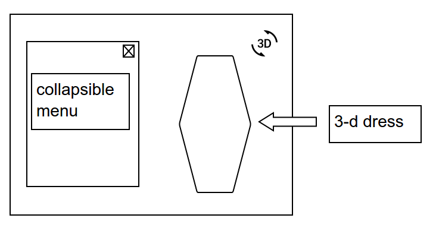
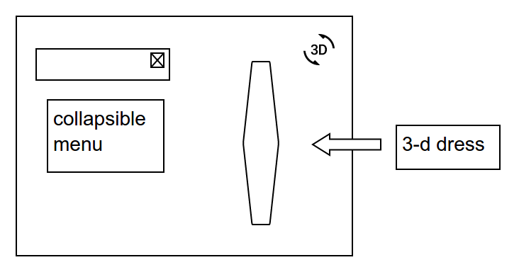

## Cloth Model

### Background

This Cloth Model is an introduction to creating and rendering 3D objects using Three.js, a light-weight JavaScript library that provides tools for working with Canvas and WebGL. Another JavaScript library used is dat.GUI, a graphical interface for the user to change variables and see their effects immediately.

The model consists of a piece of cloth with directional pattern falling on top of an invisible block.

References:
[three.js](https://github.com/mrdoob/three.js)
[dat.GUI](https://github.com/dataarts/dat.gui)

The model will have the following elements:
1) a menu on the left
2) a dress on the right

### Functionality & MVP  

In this game, the user will be able to:

- [ ] Collapse the menu
- [ ] Choose the color for the cloth and floor
- [ ] See the cloth from different angles by clicking and moving the mouse
- [ ] Change the distance of the camera by scrolling with the mouse wheel

In addition, this project will include:

- [ ] A production Readme

### Wireframes

This app will consist of a single screen.

The menu is collapsable

### Architecture and Technologies

This project will be implemented with the following technologies:

- Vanilla `JavaScript` for overall structure, game logic, and DOM manipulations
- `Three.js` to set up the scene, camera, and renderer
- `CSS` to style the menu

- `index.html` is the entry file which will also contain the elements of the menu to be styled in `application.css`, as well as the script tag that will display the dress
- `dress.js` is the script will handle the logic for creating the scene, camera, rendering, as well as initializing the block and cloth
- `cloth.js` is the script will handle the logic for the cloth's structure, movement, and constraints

### Implementation Timeline

**Day 1**: Follow the Three.js documentation to create 3D animation of a cube to familiarize with how 3D graphics and WebGL work.

**Day 2**: Create the cloth and make it stay on screen

**Day 3**: Make the cloth fall on top of the block and stay

**Day 4**: Make the view changeable and add GUI controller

### Bonus features

There are many features an expansions that can be added.  Some anticipated updates are:

- [ ] Give choices for fabric
- [ ] Toggle wind to show how the fabric responds to movement
- [ ] Make more complex structures for the cloth to fall on
- [ ] Make the cloth into a dress that a human model wears
